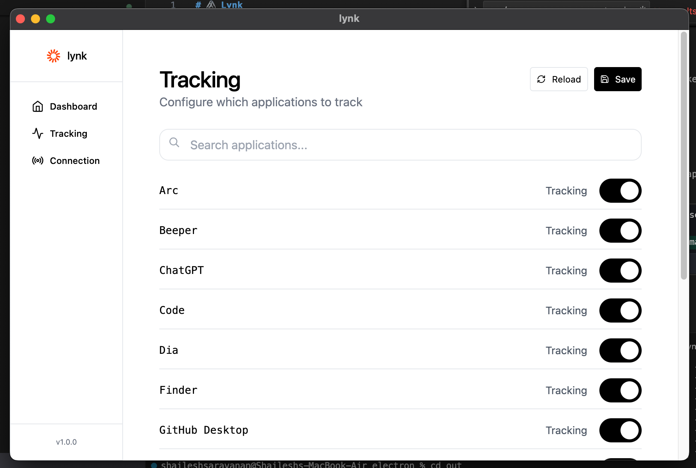

# 🖇️ Lynk

**Lynk** is a lightweight macOS app that tracks your active apps, windows, and user activity, then broadcasts that information in real-time via WebSockets. Perfect for live dashboards, productivity insights, or sharing your current activity with websites and tools.


---

## 🚀 Features

* ⏱️ Tracks current app usage (active window, app name, duration).
* 🌐 Broadcasts live data via WebSocket to any connected client.
* 🖥️ Supports integration with websites, stream overlays, or remote dashboards.
* 🔒 Private by design — data stays on your machine unless explicitly broadcast.

---

## 📦 Installation

1. **Download the latest `.dmg` or `.zip`** from the [Releases](https://github.com/Shaileshsaravanan/lynk/releases) page.
2. **Unzip or mount** the downloaded file and drag `Lynk.app` to your `/Applications` folder.
3. Since the app is **not code-signed** (since I'm not a registered apple dev), you'll need to manually clear macOS security flags:

   ```bash
   xattr -cr /Applications/Lynk.app
   ```
or you'll be having this issue and mac won't let you run the app:


4. Open `System Settings > Privacy & Security > Accessibility` and **grant permissions** to Lynk so it can detect your active windows and apps.
5. Launch the app. If macOS blocks it, go to `System Settings > Privacy & Security`, scroll down, and click **“Open Anyway”** next to the warning.

---

## 🔧 Usage

Once Lynk is running:

* It silently tracks your currently active app and window title.
* Starts a Frontend server on port `5001`.
* Starts a WebSocket server (default port `5002`) for real-time broadcasting.
* Any WebSocket-compatible client (JavaScript, Python, etc.) can connect and receive updates.

---

## 🌐 Websocket Connection

You can connect to your desktop's lynk instance using any WebSocket client, the config details are in the app. By default, lynk uses my websocket server at `https://lynk-ws-server.onrender.com` which can also be used to connect to your lynk instance. If you do want to use your own server, you can change the WebSocket URL in the app settings.


This is an example response you can expect from the server:

```json
{
  "app": "Arc",
  "apps_data": {
    "Arc": {
      "alias": "Arc",
      "icon": "some-random-base64-image-data",
      "tracking": "true"
    },
    "VNC Viewer": {
      "alias": "VNC Viewer",
      "icon": null,
      "icon_url": null,
      "tracking": "true"
    },
    "Dia": {
      "alias": "Dia",
      "icon": null,
      "icon_url": null,
      "tracking": "true"
    }
  },
  "usage": {
    "lynk": "0h 5m 3s",
    "Beeper": "0h 0m 32s",
    "Arc": "0h 22m 46s",
    "": "0h 23m 18s",
    "Finder": "0h 1m 15s",
    "GitHub Desktop": "0h 0m 10s",
    "Slack": "0h 4m 58s",
    "Spotify": "0h 0m 2s",
    "ChatGPT": "0h 0m 2s",
    "Terminal": "0h 0m 2s",
    "VNC Viewer": "0h 0m 1s",
    "Dia": "0h 2m 17s",
    "Code": "0h 7m 24s"
  }
}

```

The app will automatically send updates when you switch application, when there are websocket clients connected to it.

This is an example JS client that connects to the Lynk WebSocket server and logs the data:

```javascript
const connectionId = '1749650366140--330-a55c6069-12213'; // Replace with your actual connection ID
const ws = new WebSocket('wss://lynk-ws-server.onrender.com');

ws.onopen = () => {
    ws.send(JSON.stringify({ type: 'init', userId: connectionId }));
    console.log('Connected and init message sent');
};

ws.onmessage = (event) => {
    console.log('Message from server:', event.data);
};

ws.onerror = (e) => console.error('WebSocket error', e);
ws.onclose = () => console.log('WebSocket closed');
```

and this is an example Python client that connects to the Lynk WebSocket server and logs the data:

```python
import asyncio
import websockets
import json

async def connect():
    uri = "wss://lynk-ws-server.onrender.com"
    connection_id = "1749650366140--330-a55c6069-12213" # Replace with your actual connection ID

    async with websockets.connect(uri) as ws:
        await ws.send(json.dumps({
            "type": "init",
            "userId": connection_id
        }))
        print("Connected and init message sent.")

        async for message in ws:
            print("Message from server:", message)

asyncio.run(connect())

```

---

# 🚀 Adding app alias' and logos

You can add custom aliases and icons for apps that Lynk tracks. This helps in identifying apps more easily in the WebSocket data and allows you to natively display icons in your website, etc.

To add custom aliases and icons you need to go to the Tracking page


and then click on the app you want to add an alias or icon for. You can then enter the alias and upload an icon for that app as shown below.


---

## 🔐 Privacy

Lynk is designed with privacy in mind:

* No data leaves your machine unless explicitly sent via WebSockets.
* No external APIs or tracking.
* Open-source and auditable.

---

## 📃 License

MIT License — use freely, modify, and share.

---

## 📬 Contact

Questions, ideas, or cool uses? Reach out at [shaileshsaravanan385@gmail.com](mailto:shaileshsaravanan385@gmail.com) or open an issue!